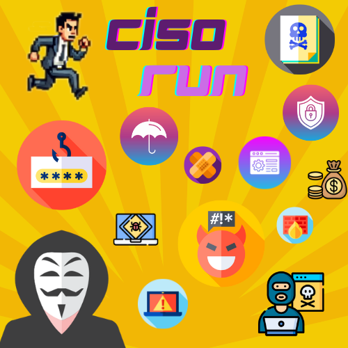
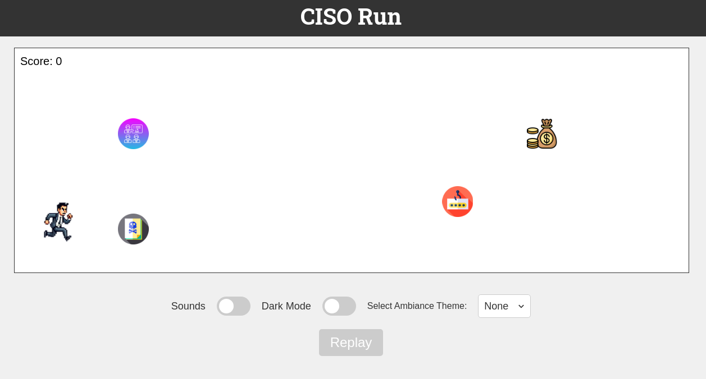
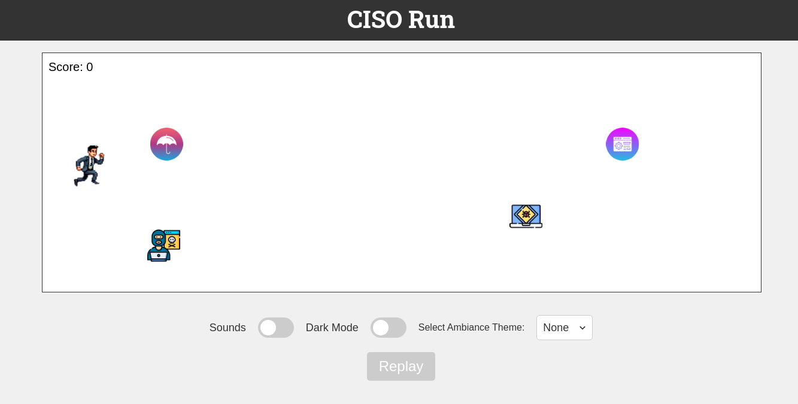
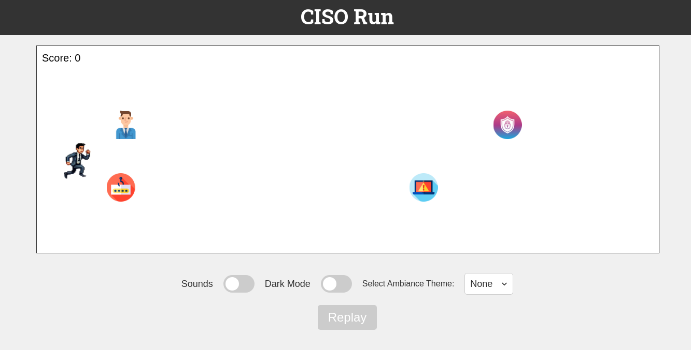
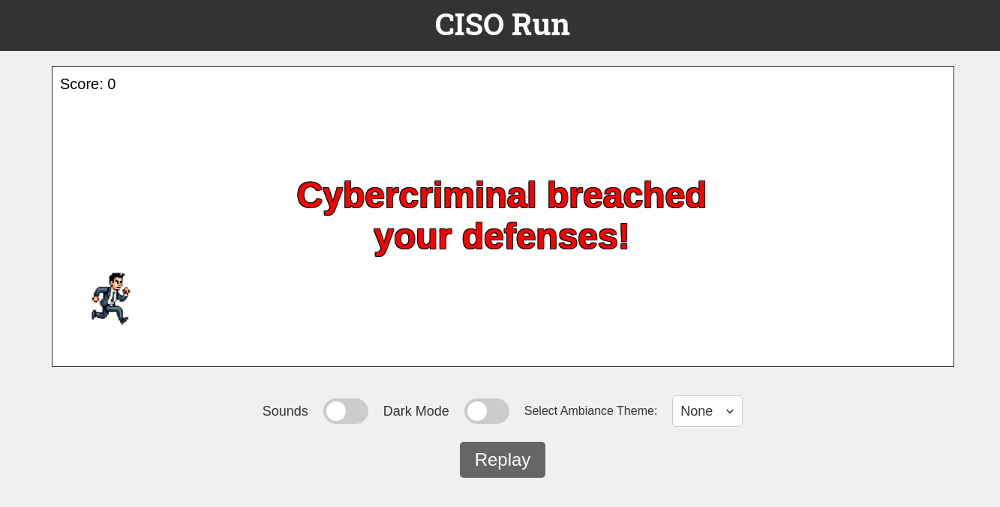

# CISO Run

**CISO Run** is an engaging and fun cybersecurity-themed game, inspired by the **Chrome Dinosaur Game**, where you play as a Chief Information Security Officer (CISO) running through various security challenges. The goal is to collect cybersecurity resources while avoiding threats like malware, ransomware, and cybercriminals.

<div align="center">
  
</div>

## Table of Contents

- [Play Online](#play-online)
- [Installation](#installation)
- [How to Play](#how-to-play)
- [Screenshots](#screenshots)
- [Credits](#credits)
- [License](#license)

---

## Play Online

You can play **CISO Run** online at:
```bash
https://www.talencesecurity.com/games/ciso-run/index.html
```
👉 **[Click here](https://www.talencesecurity.com/games/ciso-run/index.html)** 

---

## Installation

To install and run **CISO Run** locally, follow these steps:

1. **Clone the repository:**

    ```bash
    git clone https://github.com/TalenceSecurity/CISO-Run.git
    ```

2. **Navigate to the project folder:**

    ```bash
    cd CISO-Run
    ```

3. **Open `index.html` in your web browser to start playing!**

---

## How to Play

### Objective:
  
- Collect cybersecurity resources like firewalls, user training, and patches while dodging obstacles such as malware, cybercriminals, and ransomware.

### Controls:

- Press the `Space` bar or `Arrow Up` to jump.
- Press the `Arrow Down` to duck.

### Scoring:

- Earn **100 points** for every collectible you acquire. Your goal is to gather as many points as possible!

### End of Game:

- The game ends when you hit an obstacle. A message will appear, allowing you to replay and beat your high score.

### Help:

- Refer to `help.html` for further instructions.

---

## Screenshots






---

## Credits

**CISO Run** is © Talence Security. It uses several third-party assets, including images and sounds. See the [LICENSE.md](LICENSE.md) file for details.

---

## License

This project is licensed under the MIT License. See the [LICENSE.md](LICENSE.md) file for details.
